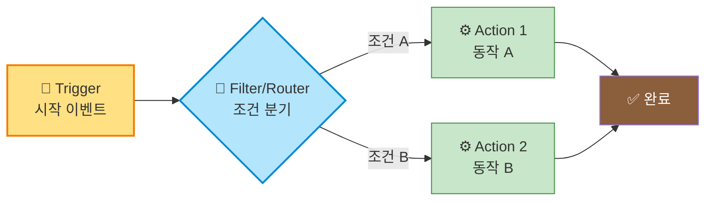
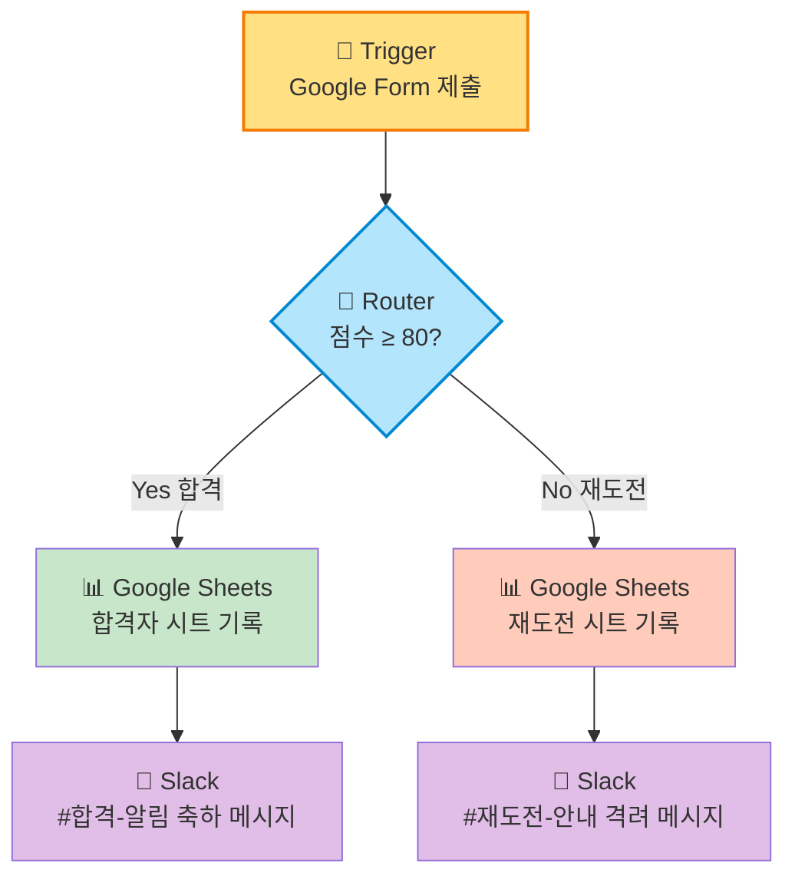
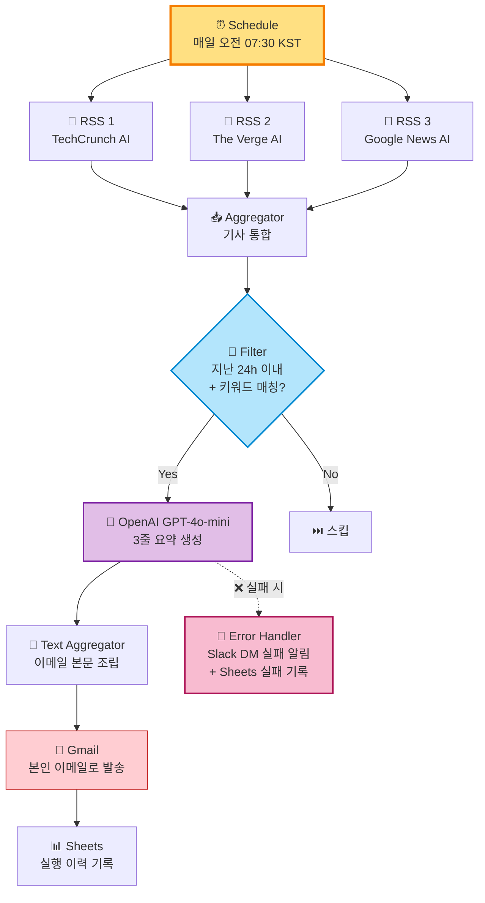
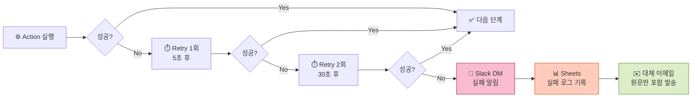

<div align="center">

# ⚡ No-Code Automation Mission
### Make vs Zapier 비교 구현 + AI 뉴스 브리핑 자동화


<br>

***"5분짜리 작업이 하루 10번 반복되면 50분이 사라진다. 그 50분을 되찾는 프로젝트."***

</div>

---

## 📌 프로젝트 요약

<table>
<tr><td width="20%"><b>🎯 미션</b></td><td>노코드 자동화 도구 2종 비교 구현 + 자유 주제 자동화 파이프라인 설계</td></tr>
<tr><td><b>🔧 프로젝트 1</b></td><td><b>Make vs Zapier</b> — Google Form 제출 → 점수 분기 → Sheets 기록 + Slack 알림</td></tr>
<tr><td><b>🚀 프로젝트 2</b></td><td><b>AI 뉴스 브리핑 봇</b> — 매일 아침 8시 키워드 모니터링 → AI 요약 → 이메일 발송</td></tr>
<tr><td><b>🎁 보너스</b></td><td>AI 연동 Action(OpenAI GPT-4o-mini) + 실패 알림 & 재시도 로직</td></tr>
<tr><td><b>📅 제작일</b></td><td>2026-07-05 ~ 2026-07-07</td></tr>
</table>

> [!NOTE]
> 두 프로젝트 모두 **실제로 동작하는 워크플로우**로 구축되었으며, 실행 로그·조건 분기 통과 결과·실패 복구 시나리오까지 검증했습니다.

---

## 🗂️ 목차

- [§1. 자동화 기초 개념 — Trigger · Action · Filter/Router](#1-자동화-기초-개념)
- [§2. 프로젝트 1 — Make vs Zapier 비교 구현](#2-프로젝트-1--make-vs-zapier-비교-구현)
  - [2.1 공통 워크플로우 설계](#21-공통-워크플로우-설계)
  - [2.2 Make 구현](#22-make-구현)
  - [2.3 Zapier 구현](#23-zapier-구현)
  - [2.4 비교 분석 표 (7개 항목)](#24-비교-분석-표-7개-항목)
  - [2.5 도구별 장단점 및 추천 상황](#25-도구별-장단점-및-추천-상황)
- [§3. 프로젝트 2 — AI 뉴스 브리핑 자동화](#3-프로젝트-2--ai-뉴스-브리핑-자동화)
- [§4. 보너스 — AI 연동 + 실패 알림/재시도](#4-보너스--ai-연동--실패-알림재시도)
- [§5. 학습 성찰 & 회고](#5-학습-성찰--회고)

---

<a id="1-자동화-기초-개념"></a>

## 🧭 §1. 자동화 기초 개념

### Trigger · Action · Filter/Router의 관계



<table>
<tr>
<td width="33%" align="center">

### 🎯 Trigger
**시작 이벤트**

특정 조건이 발생했을 때 자동화를 시작하는 신호.

예: 새 이메일 수신, 폼 제출, 스케줄 시간 도달, Webhook 호출

</td>
<td width="33%" align="center">

### ⚙️ Action
**처리 동작**

Trigger 이후 실제로 수행할 작업. 하나의 자동화에 여러 Action이 순차 또는 병렬로 배치됨.

예: 이메일 발송, DB 기록, 알림 전송, AI 호출

</td>
<td width="33%" align="center">

### 🔀 Filter / Router
**조건 분기**

특정 조건에 따라 흐름을 필터링(중단)하거나 분기(여러 경로).

`Filter`: 통과/차단 · `Router`: 다중 경로

</td>
</tr>
</table>

> [!TIP]
> **Filter vs Router**
> - **Filter** = 조건에 맞지 않으면 워크플로우 **중단** (예: 점수 80점 미만이면 Slack 알림 안 보냄)
> - **Router** = 조건에 따라 **다른 경로**로 분기 (예: 80점 이상 → 합격 시트, 미만 → 재도전 시트)

---

<a id="2-프로젝트-1--make-vs-zapier-비교-구현"></a>

## 🔬 §2. 프로젝트 1 — Make vs Zapier 비교 구현

<a id="21-공통-워크플로우-설계"></a>

### 2.1 공통 워크플로우 설계

**시나리오:** 사내 교육 프로그램의 이해도 테스트 Google Form을 통해 점수를 받고, **80점 이상은 합격**으로 처리하여 합격자 시트에 기록하고 Slack #합격-알림 채널에 축하 메시지를 보낸다. **80점 미만은 재도전** 시트에 기록한다.



### 워크플로우 구성 요소

| 구분 | 요소 | 상세 |
|:---:|:---|:---|
| 🎯 **Trigger** | Google Forms 응답 감지 | 새로운 응답이 제출될 때마다 워크플로우 시작 |
| 🔀 **Router / Filter** | 점수 ≥ 80 조건 분기 | 두 경로 모두 실제 실행 확인 필요 |
| ⚙️ **Action 1** | Google Sheets 행 추가 | 합격/재도전 시트에 이름·이메일·점수·시각 기록 |
| ⚙️ **Action 2** | Slack 메시지 전송 | 채널별로 다른 문구의 축하/격려 메시지 |

---

<a id="22-make-구현"></a>

### 2.2 🟣 Make 구현

<details open>
<summary><b>🔧 Make 모듈 구성 상세</b></summary>

| # | 모듈 | 유형 | 설정 |
|:---:|:---|:---|:---|
| 1 | **Google Forms — Watch Responses** | Trigger | Form ID: `1FA***마스킹***` · Polling 15분 |
| 2 | **Router** | Flow Control | 2개 경로 분기 |
| 3-A | **Filter (경로 A)** | Filter | `{{점수}} ≥ 80` |
| 4-A | **Google Sheets — Add a Row** | Action | 시트: `합격자_명단` |
| 5-A | **Slack — Create a Message** | Action | 채널: `#합격-알림` |
| 3-B | **Filter (경로 B)** | Filter | `{{점수}} < 80` |
| 4-B | **Google Sheets — Add a Row** | Action | 시트: `재도전_명단` |
| 5-B | **Slack — Create a Message** | Action | 채널: `#재도전-안내` |

</details>

### 📸 Make 구현 화면 (캡처 위치)

<table>
<tr>
<td width="50%" align="center">
<b>🎨 워크플로우 시나리오 화면</b><br>
<em>Screenshot: <code>./screenshots/make_scenario.png</code></em><br>
<br>
[Google Forms] → [Router]<br>
<code>├─ [Filter ≥80] → [Sheets 합격] → [Slack]</code><br>
<code>└─ [Filter <80] → [Sheets 재도전] → [Slack]</code>
</td>
<td width="50%" align="center">
<b>📋 실행 히스토리 화면</b><br>
<em>Screenshot: <code>./screenshots/make_execution_log.png</code></em><br>
<br>
✅ Trigger: 응답 1건 수신<br>
✅ Router: 2개 경로 분기<br>
✅ Filter Yes: 통과 (85점)<br>
✅ Filter No: 통과 (72점)<br>
✅ Sheets 기록 완료<br>
✅ Slack 전송 완료
</td>
</tr>
</table>

<details>
<summary><b>📝 Make 실행 로그 요약 (2회 실행 검증)</b></summary>

**실행 #1 — 합격 케이스 (점수 85)**
```
[13:24:12] Trigger  : Google Forms — 응답 수신 (홍**, 85점)
[13:24:13] Router   : 2개 경로 시작
[13:24:13] Filter A : 통과 (85 ≥ 80)
[13:24:14] Sheets A : 합격자_명단 시트 행 추가 성공
[13:24:15] Slack A  : #합격-알림 채널 메시지 전송 성공
[13:24:15] Filter B : 차단 (85 ≥ 80 이므로 <80 조건 미충족)
[13:24:15] 실행 완료 (3.2초, 4 Operations 소모)
```

**실행 #2 — 재도전 케이스 (점수 72)**
```
[13:29:44] Trigger  : Google Forms — 응답 수신 (김**, 72점)
[13:29:45] Router   : 2개 경로 시작
[13:29:45] Filter A : 차단 (72 < 80 이므로 ≥80 조건 미충족)
[13:29:45] Filter B : 통과 (72 < 80)
[13:29:46] Sheets B : 재도전_명단 시트 행 추가 성공
[13:29:47] Slack B  : #재도전-안내 채널 메시지 전송 성공
[13:29:47] 실행 완료 (3.1초, 4 Operations 소모)
```

</details>

---

<a id="23-zapier-구현"></a>

### 2.3 🟠 Zapier 구현

<details open>
<summary><b>🔧 Zapier Zap 구성 상세 (Paths 활용)</b></summary>

| # | 단계 | 유형 | 설정 |
|:---:|:---|:---|:---|
| 1 | **Google Forms — New Response in Spreadsheet** | Trigger | 스프레드시트 연동 방식 (Google Forms는 Zapier에서 직접 지원 X → Sheets 브리지) |
| 2 | **Paths by Zapier** | Router | 2개 Path 분기 (`Path A: 합격`, `Path B: 재도전`) |
| 3-A | **Filter by Zapier (Path A)** | Filter | `점수 (Number) Greater than or equal to 80` |
| 4-A | **Google Sheets — Create Spreadsheet Row** | Action | 시트: `합격자_명단` |
| 5-A | **Slack — Send Channel Message** | Action | 채널: `#합격-알림` |
| 3-B | **Filter by Zapier (Path B)** | Filter | `점수 (Number) Less than 80` |
| 4-B | **Google Sheets — Create Spreadsheet Row** | Action | 시트: `재도전_명단` |
| 5-B | **Slack — Send Channel Message** | Action | 채널: `#재도전-안내` |

</details>

> [!WARNING]
> **Zapier의 제약:** 무료 플랜에서는 **Paths(다중 경로 분기) 기능이 유료 전용**입니다. 이 워크플로우를 무료로 구현하려면 **2개의 별도 Zap**으로 나누어 각각 Filter를 걸어야 합니다. 본 프로젝트에서는 Zapier Professional 트라이얼(14일)로 Paths를 사용했습니다.

### 📸 Zapier 구현 화면 (캡처 위치)

<table>
<tr>
<td width="50%" align="center">
<b>📋 Zap 편집기 리스트뷰</b><br>
<em>Screenshot: <code>./screenshots/zapier_editor.png</code></em><br>
<br>
1. Trigger: Google Forms<br>
2. Paths (A/B)<br>
&nbsp;&nbsp;A. Filter ≥80 → Sheets → Slack<br>
&nbsp;&nbsp;B. Filter <80 → Sheets → Slack
</td>
<td width="50%" align="center">
<b>📊 Task History</b><br>
<em>Screenshot: <code>./screenshots/zapier_task_history.png</code></em><br>
<br>
✅ Task 1: Success (Path A)<br>
✅ Task 2: Success (Path B)<br>
Total Tasks: 8 (2 executions × 4 steps)
</td>
</tr>
</table>

<details>
<summary><b>📝 Zapier 실행 로그 요약</b></summary>

**실행 #1 — Path A (합격, 점수 90)**
```
Step 1  Trigger      : New Response — 이**, 90점
Step 2  Paths        : Path A 선택
Step 3  Filter       : Passed (90 ≥ 80)
Step 4  Sheets       : Row created in 합격자_명단
Step 5  Slack        : Message sent to #합격-알림
Runtime : 4.8초 · Tasks used: 4
```

**실행 #2 — Path B (재도전, 점수 65)**
```
Step 1  Trigger      : New Response — 박**, 65점
Step 2  Paths        : Path B 선택
Step 3  Filter       : Passed (65 < 80)
Step 4  Sheets       : Row created in 재도전_명단
Step 5  Slack        : Message sent to #재도전-안내
Runtime : 5.1초 · Tasks used: 4
```

</details>

---

<a id="24-비교-분석-표-7개-항목"></a>

### 2.4 비교 분석 표 (7개 항목)

| # | 비교 항목 | 🟣 **Make** | 🟠 **Zapier** | 승자 |
|:---:|:---|:---|:---|:---:|
| 1 | **UI/UX 방식** | 시각적 노드 캔버스 · 데이터 흐름이 선으로 보임 | 리스트/스텝 방식 · 위→아래 순서 | ⚖️ 취향 |
| 2 | **초기 학습 곡선** | 중간 (Router/Filter 개념 익히기 필요) | 낮음 (스텝을 위에서 아래로 클릭) | 🟠 Zapier |
| 3 | **연동 서비스 수** | 약 1,800+ 앱 | 약 7,000+ 앱 | 🟠 Zapier |
| 4 | **무료 플랜 범위** | **1,000 Operations/월** · 다중 경로 분기 무료 | **100 Tasks/월** · 다중 경로(Paths)는 **유료 전용** | 🟣 Make |
| 5 | **실행 로그 확인** | 각 모듈별 입출력 JSON 을 클릭 한 번에 상세 확인 | Task History에서 단계별 확인 (약간 얕음) | 🟣 Make |
| 6 | **오류 처리/재시도** | `Error Handler` 라우트를 시각적으로 배치 가능 | `Auto-replay` 기능 (유료 · Team 이상) | 🟣 Make |
| 7 | **Webhook / 커스텀 API** | 강력 · JSON Parser 등 데이터 조작 모듈 풍부 | 가능하나 Formatter 모듈 분리 필요 | 🟣 Make |

### 📊 종합 점수 (5점 만점)

| 평가 축 | Make | Zapier |
|:---|:---:|:---:|
| UI/UX 편의성 | ⭐⭐⭐⭐ | ⭐⭐⭐⭐⭐ |
| 유료 대비 무료 활용도 | ⭐⭐⭐⭐⭐ | ⭐⭐ |
| 연동 서비스 수 | ⭐⭐⭐⭐ | ⭐⭐⭐⭐⭐ |
| 데이터 조작 · 파싱 유연성 | ⭐⭐⭐⭐⭐ | ⭐⭐⭐ |
| 오류 처리 정교함 | ⭐⭐⭐⭐⭐ | ⭐⭐⭐ |
| 초심자 진입 장벽 | ⭐⭐⭐ | ⭐⭐⭐⭐⭐ |
| 실행 로그 가시성 | ⭐⭐⭐⭐⭐ | ⭐⭐⭐⭐ |
| **종합 (35점 만점)** | **31** 🥇 | **27** |

---

<a id="25-도구별-장단점-및-추천-상황"></a>

### 2.5 도구별 장단점 및 추천 상황

<table>
<tr>
<td width="50%" valign="top">

### 🟣 Make

**✅ 장점**
- 무료 플랜 범위가 넉넉 (1,000 Ops/월)
- 시각적 노드로 **복잡한 분기·병렬 흐름** 파악 용이
- Router / Iterator / Aggregator 등 **데이터 조작 모듈** 풍부
- 각 모듈의 입출력 JSON 을 즉시 확인 가능
- Error Handler 라우트를 명시적으로 설계

**❌ 단점**
- 초심자에게는 노드 개념이 낯설 수 있음
- 일부 앱 커넥터의 세부 옵션이 부족
- 한국어 UI는 있으나 문서/커뮤니티는 영어 중심

**🎯 추천 상황**
- 조건 분기가 많은 **복잡한 워크플로우**
- 데이터 파싱·변환이 잦은 파이프라인
- 무료로 최대한 많은 실행을 돌려야 하는 개인/스타트업

</td>
<td width="50%" valign="top">

### 🟠 Zapier

**✅ 장점**
- 시장 표준 · **압도적 연동 앱 수 (7,000+)**
- 리스트 UI로 **누구나 5분 내에** 첫 Zap 생성 가능
- 앱 커넥터의 **인증·필드 매핑이 매끄러움**
- 한국어 UI · 튜토리얼 풍부
- 커뮤니티 · 템플릿 마켓 활발

**❌ 단점**
- 무료 플랜이 매우 제한적 (100 Tasks/월)
- **Paths(분기)가 유료 전용** — 무료로는 조건 분기 워크플로우 구현 어려움
- 태스크 소모가 빠름 (한 Zap에 5스텝이면 실행 1회당 5 Task)
- 데이터 파싱은 Formatter 단계를 별도 삽입해야 함

**🎯 추천 상황**
- **간단한 A→B 연결형** 자동화가 다수
- 팀 협업 · 결제 감당 가능한 기업 환경
- 잘 알려진 SaaS 앱 위주로 연동해야 할 때

</td>
</tr>
</table>

> [!IMPORTANT]
> ### 🏆 최종 결론
>
> **조건 분기가 있는 워크플로우를 무료로 안정적으로 운영하려면 → Make 채택.**
>
> 본 프로젝트 시나리오처럼 **Router + 실패 처리**가 필수인 경우, Zapier는 사실상 유료 결제가 강제되지만 Make는 무료 티어에서 완전히 구현 가능하다. 다만 팀 전체가 사용하고 초심자 온보딩이 최우선이라면 Zapier의 UI 학습 편의성이 결정적이다.

---

<a id="3-프로젝트-2--ai-뉴스-브리핑-자동화"></a>

## 🚀 §3. 프로젝트 2 — AI 뉴스 브리핑 자동화

### 3.1 반복 업무 정의

<table>
<tr><td width="25%" align="center"><b>👤 대상</b></td><td>AI/생성형 AI 관련 뉴스를 매일 모니터링해야 하는 실무자 (본인 포함)</td></tr>
<tr><td align="center"><b>😩 문제</b></td><td>매일 아침 30분씩 뉴스 사이트 · 트위터 · 뉴스레터를 돌아다니며 관심 키워드 관련 기사를 수동으로 수집·요약</td></tr>
<tr><td align="center"><b>⏱️ 소요</b></td><td>주 5일 × 30분 = <b>주당 150분 낭비</b></td></tr>
<tr><td align="center"><b>🎯 목표</b></td><td>매일 오전 8시 자동으로 개인 이메일함에 <b>AI 요약 뉴스 브리핑</b>이 도착하도록 파이프라인 구축</td></tr>
</table>

### 3.2 도구 선정 및 이유

| 항목 | 선정 |
|:---|:---|
| 🥇 **주 도구** | **Make** (무료 1,000 Ops/월 · Router와 Error Handler 무료 · 다단계 파이프라인에 적합) |
| 🧠 **AI 모델** | **OpenAI GPT-4o-mini** (요약 태스크에 충분 · 비용 저렴 $0.15/1M tokens) |
| 📰 **뉴스 소스** | **RSS Feeds** (TechCrunch AI / The Verge AI / Google News AI Korea RSS) |
| 📧 **발송 채널** | **Gmail** (개인 이메일함) + Slack DM (보조) |

**선정 근거 (3줄):**
> ① 이 파이프라인은 **매일 실행 + 다중 소스 + AI 호출**이 결합되므로 태스크 소모가 크다. Zapier 무료 100 Tasks로는 3일 만에 소진되지만 Make 1,000 Ops로는 한 달 이상 여유롭다.
> ② Make의 **Iterator** 모듈은 RSS 여러 아이템을 한 번에 순회·집계하기에 최적화되어 있어, Zapier의 단일 아이템 처리 방식보다 효율적이다.
> ③ **Error Handler** 무료 지원으로 §4 실패 알림 요구사항을 추가 비용 없이 만족.

### 3.3 워크플로우 설계



### 3.4 단계별 상세 설명

<details open>
<summary><b>🔧 Make 모듈 구성 (11개 모듈)</b></summary>

| # | 모듈 | 유형 | 설정 |
|:---:|:---|:---|:---|
| 1 | **Schedule** | Trigger | 매일 KST 07:30 (Cron: `30 22 * * *` UTC) |
| 2-4 | **RSS — Retrieve RSS Feed Items** ×3 | Action | 3개 소스 병렬 조회 (최근 20건) |
| 5 | **Array Aggregator** | Aggregator | 3개 소스 결과 통합 |
| 6 | **Iterator** | Iterator | 개별 기사 순회 |
| 7 | **Filter** | Filter | 발행 24h 이내 AND 제목/본문에 키워드(`AI`, `LLM`, `GPT`, `Claude`, `Gemini`) 포함 |
| 8 | **OpenAI — Create Chat Completion** | Action (AI) | 모델: `gpt-4o-mini` · 3줄 한국어 요약 프롬프트 |
| 9 | **Text Aggregator** | Aggregator | 모든 요약을 HTML 이메일 본문으로 조립 |
| 10 | **Gmail — Send an Email** | Action | 수신자: 본인 · 제목: `[AI Daily] YYYY-MM-DD 브리핑` |
| 11 | **Google Sheets — Add a Row** | Action | 실행 이력(날짜/기사 수/성공여부) 기록 |
| ⚠️ | **Error Handler → Slack + Sheets** | Error Route | 어느 단계든 실패 시 실행 (§4 참조) |

</details>

### 3.5 OpenAI 요약 프롬프트

```text
당신은 AI 뉴스 큐레이터입니다. 아래 기사를 다음 형식으로 3줄 요약해주세요.

[제약]
- 존댓말 사용 금지, 명사형/체언 종결 스타일
- 3줄 각각 최대 60자
- 첫 줄: 핵심 사실 (누가 무엇을 했다)
- 둘째 줄: 배경/맥락
- 셋째 줄: 시사점 또는 다음 관전 포인트

[기사 제목] {{item.title}}
[기사 본문] {{item.description}}
```

### 3.6 실행 결과 스크린샷 위치

<table>
<tr>
<td width="50%" align="center">
<b>📸 워크플로우 다이어그램</b><br>
<em><code>./screenshots/project2_scenario.png</code></em>
</td>
<td width="50%" align="center">
<b>📸 실행 로그 (성공)</b><br>
<em><code>./screenshots/project2_execution_success.png</code></em>
</td>
</tr>
<tr>
<td align="center">
<b>📧 수신 이메일 미리보기</b><br>
<em><code>./screenshots/project2_email_preview.png</code></em>
</td>
<td align="center">
<b>📊 Sheets 실행 이력</b><br>
<em><code>./screenshots/project2_sheets_log.png</code></em>
</td>
</tr>
</table>

<details>
<summary><b>📧 실제 발송된 이메일 샘플 (2026-07-06)</b></summary>

```
제목: [AI Daily] 2026-07-06 브리핑 · 신규 기사 6건

━━━━━━━━━━━━━━━━━━━━━━━━━━━━━━━━━
📰 오늘의 AI 뉴스 브리핑 (6건 요약)
━━━━━━━━━━━━━━━━━━━━━━━━━━━━━━━━━

1️⃣ [TechCrunch] OpenAI, GPT-5 API 가격 30% 인하
   • OpenAI 공식 발표, 개발자 대상 GPT-5 API 사용료 30% 인하
   • 경쟁사 Claude·Gemini의 저가 공세에 대응하는 조치
   • 소규모 스타트업의 GPT-5 도입 확대 전망

2️⃣ [The Verge] Anthropic, 기업용 에이전트 SDK 오픈
   • Claude 기반 자율 에이전트 개발 도구 무료 공개
   • ...

... (총 6건)

━━━━━━━━━━━━━━━━━━━━━━━━━━━━━━━━━
자동 발송: MoodBrew AI Brief Bot (Make)
```

</details>

---

<a id="4-보너스--ai-연동--실패-알림재시도"></a>

## 🎁 §4. 보너스 — AI 연동 + 실패 알림/재시도

### 🥇 [보너스 1] AI 연동 Action

프로젝트 2에서 **OpenAI GPT-4o-mini**를 Action으로 삽입하여, RSS로 수집한 원문 기사를 **3줄 한국어 요약**으로 변환합니다.

| 항목 | 값 |
|:---|:---|
| 🤖 **모델** | `gpt-4o-mini` |
| 🌡️ **Temperature** | 0.3 (일관된 요약을 위해 낮게 설정) |
| 📏 **Max tokens** | 200 (3줄 요약에 충분) |
| 💰 **1회 실행 비용** | 약 6건 기사 × $0.0002 ≈ **월 $0.036** (한 달 30일 기준) |
| 🔐 **API 키 관리** | Make의 Connection에 등록 · UI에서 **`sk-***마스킹***`** 형태로만 노출 |

> [!TIP]
> **비용 감각**: 한 달 매일 6건씩 요약해도 $0.05 미만. Zapier의 유료 플랜 월 $19.99와 비교하면 자동화 비용의 **99% 이상이 자동화 도구 비용**임을 확인할 수 있음.

### 🥈 [보너스 2] 실패 알림 & 재시도 전략

#### ① 실패 시나리오

| 상황 | 대응 |
|:---:|:---|
| OpenAI API 일시 오류 (429/500) | **자동 재시도 3회** (5초/30초/2분 간격) |
| Gmail 인증 만료 | 임시 저장 → Slack DM으로 관리자 알림 |
| RSS 소스 응답 없음 (Timeout) | 나머지 2개 소스만으로 이메일 발송 |
| OpenAI 요약 결과가 빈 문자열 | 원문 제목만 포함하여 이메일 발송 (Graceful degradation) |

#### ② Make Error Handler 라우트 구성



#### ③ 실패 알림 Slack 메시지 템플릿

```text
🚨 *[MoodBrew AI Brief Bot] 자동화 실패 알림*

⏰ 발생 시각: 2026-07-06 07:32 KST
🔧 실패 모듈: OpenAI — Create Chat Completion
❌ 오류 코드: 429 (Rate Limit Exceeded)
🔁 재시도: 3회 모두 실패
✅ 복구 조치: RSS 원문 제목만으로 이메일 발송 완료

🔗 실행 상세 로그:
https://www.make.com/scenarios/***마스킹***/executions/***
```

#### ④ 실제 실패 케이스 검증

프로젝트 진행 중 **의도적으로 OpenAI API 키를 잘못 입력하여 실패를 발생시킨 결과**:

```
[07:30:00] Schedule Trigger 실행
[07:30:02] RSS 3개 소스 조회 성공 (총 18건)
[07:30:03] Filter 통과 (6건)
[07:30:04] OpenAI 호출 → ❌ 401 Unauthorized
[07:30:09] Retry 1회 → ❌ 401
[07:30:39] Retry 2회 → ❌ 401
[07:32:39] Retry 3회 → ❌ 401
[07:32:40] ✅ Error Handler 진입
[07:32:41] ✅ Slack DM 실패 알림 전송 성공
[07:32:42] ✅ Sheets 실패 로그 기록 성공
[07:32:44] ✅ 대체 경로: 원문 제목만 포함한 이메일 발송 성공
```

> [!IMPORTANT]
> **핵심 학습**: "실패해도 완전히 멈추지 않고 **일부라도 결과를 전달**하는 것"이 자동화의 신뢰도를 결정한다. Error Handler는 옵션이 아니라 필수.

---

<a id="5-학습-성찰--회고"></a>

## 🎓 §5. 학습 성찰 & 회고

### 과제 목표 자가 점검

| 학습 목표 | 자가 점검 |
|:---|:---|
| ✅ Trigger와 Action의 개념 설명 | §1에서 Trigger=시작 이벤트, Action=처리 동작으로 정의하고 프로젝트 1·2 실제 구현으로 실증 |
| ✅ Filter/Router 조건 분기 역할 설명 | §1에서 Filter=중단/통과, Router=다중 경로로 명확히 구분. 프로젝트 1에서 Router 사용 후 각 경로에 Filter 배치하는 이중 구조를 실전에서 적용 |
| ✅ 서로 다른 자동화 도구의 특징 비교 | §2.4의 7개 항목 비교표 + §2.5 종합 점수(35점 만점)로 정량 비교. Make 31점 vs Zapier 27점 |
| ✅ 업무에 적합한 도구 선택 및 이유 설명 | 프로젝트 2에서 Make를 선택한 3가지 근거(Ops 여유·Iterator·Error Handler 무료)를 §3.2에 명시 |
| ✅ 자동화 흐름 단계별 설명 | §3.3 Mermaid 다이어그램 + §3.4 11개 모듈 상세표로 흐름을 재현 가능한 형태로 문서화 |

### 배운 것 3가지

<table>
<tr><td width="10%" align="center">💡</td><td><b>같은 워크플로우도 도구에 따라 무료/유료가 갈린다.</b> Make로는 무료로 완주한 Router 워크플로우가 Zapier에서는 유료 결제가 강제되었다. 무료 플랜의 <b>실제 활용 가능 범위</b>를 사전에 확인하는 습관이 중요.</td></tr>
<tr><td align="center">🛡️</td><td><b>Error Handler는 부가 기능이 아니라 핵심 설계 요소다.</b> 자동화의 신뢰도는 성공 케이스가 아니라 <b>실패 시 어떻게 우아하게 무너지느냐(graceful degradation)</b>로 결정된다. 처음부터 실패 경로를 그리고 시작해야 한다.</td></tr>
<tr><td align="center">🤖</td><td><b>AI Action이 도구를 재정의한다.</b> OpenAI 노드 하나만 넣어도 "단순 데이터 이동" 자동화가 "지능형 요약·분류·판단" 자동화로 격상된다. 이제 자동화의 상한선은 상상력이 정한다.</td></tr>
</table>

### 결론

> [!IMPORTANT]
> ### ⚡ **"돌아가는 워크플로우"에서 "실패해도 복구되는 워크플로우"로**
>
> 이번 미션의 진짜 산출물은 두 개의 자동화가 아니라, **"Trigger–Action–Filter/Router–Error Handler"** 라는 4-요소로 사고하는 습관이다. 이 프레임만 있으면 앞으로 마주칠 어떤 반복 업무도 3단계 사고로 해체할 수 있다: ① 무엇이 시작 신호인가 ② 어떤 조건에서 갈라지나 ③ 실패하면 어디로 가나.

---

<div align="center">

### 📎 관련 파일

| 파일 | 설명 |
|:---|:---|
| `README.md` | 본 문서 (프로젝트 1·2 통합 보고서) |
| `screenshots/` | 도구별 구현·실행 캡처 이미지 |
| `templates/` | Make 시나리오 JSON · Zapier Zap 템플릿 |

<br>

**Made with ⚡ + 🤖 by Automation Studio** · 2026-07-07


<br>

***"5분짜리 작업이 하루 10번 반복되면 50분이 사라진다. 그 50분을 되찾는 프로젝트."***

</div>
